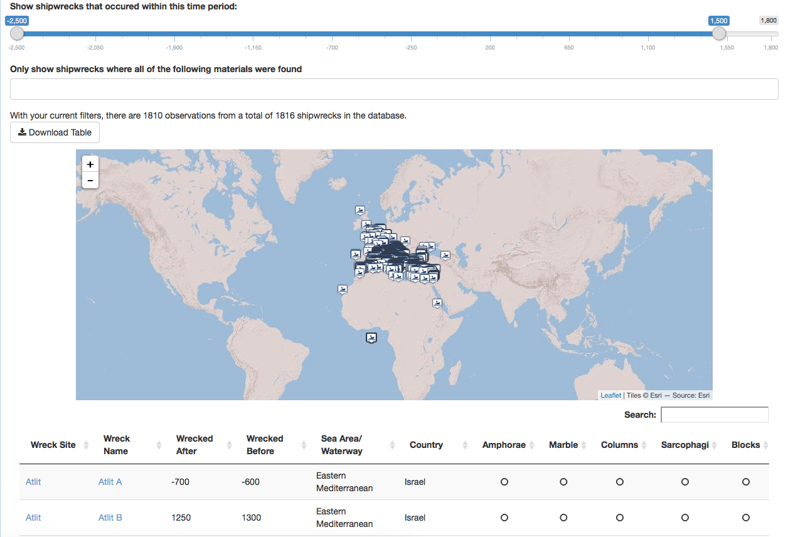

# Oxford Roman Economy Project

This is a collection of Shiny apps designed and developed to provide interactivity for University of Oxford's [Roman Economy Project](https://oxrep.web.ox.ac.uk). These Shiny apps provide an interactive interface to the OxRep database, hosted by the Classics department.

The academic contact for this work is (Professor Andrew Wilson)[http://www.arch.ox.ac.uk/AW1.html]. A screenshot of the tool for exploring the Shipwrecks database is provided below:

</img>

This code has been deposited on Figshare: http://doi.org/10.6084/m9.figshare.5539942
